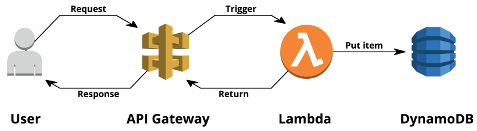
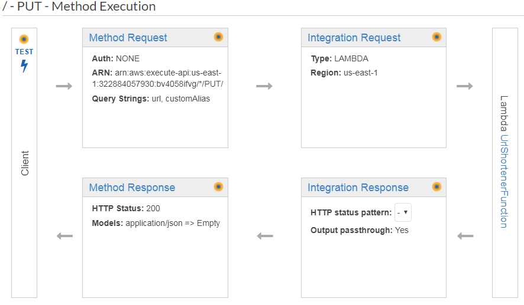
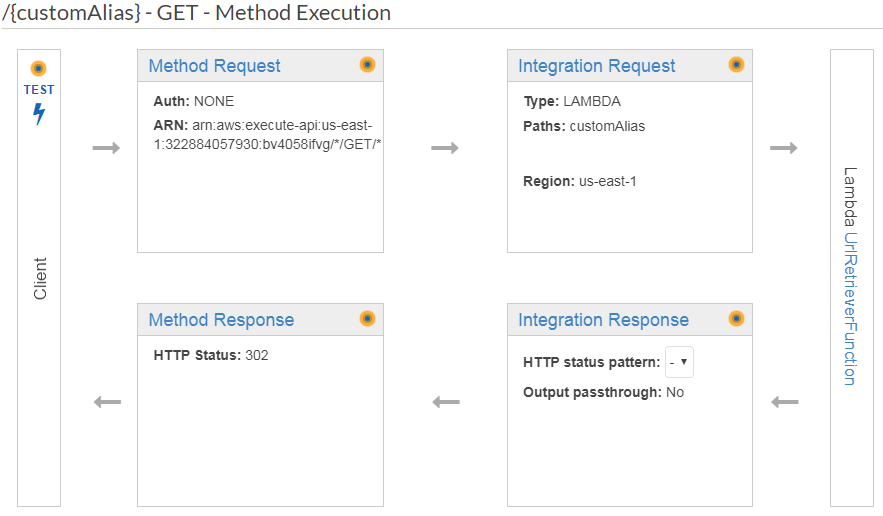

# Hire.me
Um pequeno projeto da Bemobi para testar habilidades como programador.

## Projeto

O projeto consiste em reproduzir um encurtador de URL's (apenas sua API), simples e com poucas funções.

Utilizei os serviços da AWS para implementar este projeto. Abaixo segue um resumo da estrutura:



O projeto consiste de dois casos de uso: 

1. Shorten URL
2. Retrieve URL

### 1 - Shorten URL


1. Usuario chama a API passando a URL que deseja encurtar e um parametro opcional **customAlias**
    1. Caso o **customAlias** já exista, um erro especifico ```{ERR_CODE: 001, Description:CUSTOM ALIAS ALREADY EXISTS}``` deve ser retornado.
    2. Toda URL criada sem um **customAlias** é reduzida a um novo alias
	
2. O Registro é colocado em um repositório (No caso o DynamoDB)

3. É retornado para o cliente um resultado que contenha a URL encurtada e outros detalhes como
    1. Quanto tempo a operação levou
    2. URL Original

Exemplos (Você não precisa seguir este formato):

* Chamada sem customAlias
```
PUT https://bv4058ifvg.execute-api.us-east-1.amazonaws.com/dev/?url=http://www.bemobi.com.br

{
   "alias": "XYhakR9",
   "url": "https://bv4058ifvg.execute-api.us-east-1.amazonaws.com/dev/XYhakR9",
   "statistics": {
       "time_taken": "10ms",
   }
}
```

* Chamada com CUSTOM_ALIAS
```
PUT https://bv4058ifvg.execute-api.us-east-1.amazonaws.com/dev/?url=http://www.bemobi.com.br&customAlias=bemobi

{
   "alias": "bemobi",
   "url": "https://bv4058ifvg.execute-api.us-east-1.amazonaws.com/dev/bemobi",
   "statistics": {
       "time_taken": "12ms",
   }
}
```

* Chamada com customAlias que já existe
```
PUT https://bv4058ifvg.execute-api.us-east-1.amazonaws.com/dev/?url=http://www.github.com&customAlias=bemobi

{
   "alias": "bemobi",
   "err_code": "001",
   "description": "CUSTOM ALIAS ALREADY EXISTS"
}
```

### 2 - Retrieve URL



1. Usuario chama a API passando a URL que deseja acessar
    1. Caso a **URL** não exista, um erro especifico ```{ERR_CODE: 002, Description:SHORTENED URL NOT FOUND}``` deve ser retornado.
2. O Registro é lido de um repositório (no caso o DynamoDB)
3. Esta tupla ou registro é mapeado para uma entidade de seu projeto
3. É retornado para o cliente um resultado que contenha a URL final, a qual ele deve ser redirecionado automaticamente
